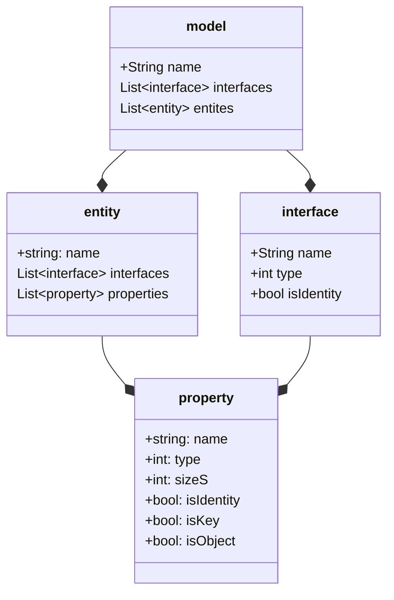

# Textrude Sample Projects and Helpers

Project files for the excellent **TextrudeInteractive** which is part of the Textrude suite by Neil MacMullen  [here](https://github.com/NeilMacMullen/Textrude)

Yaml model 

 
When specifying an entity interface name, additional information can be supplied as follows
interface name:beforeafter:usekey 
Eg.
<pre>
entities
- name: User   
- interfaces: IUser:0:true
</pre>
beforeafter:
Indicate if the interface properties are to be rendered before or after the entities main properties
where 0 for before and a 1 would render them after
useKey:
Set a value indicating if sql generation will use the interfaces key (if defined)